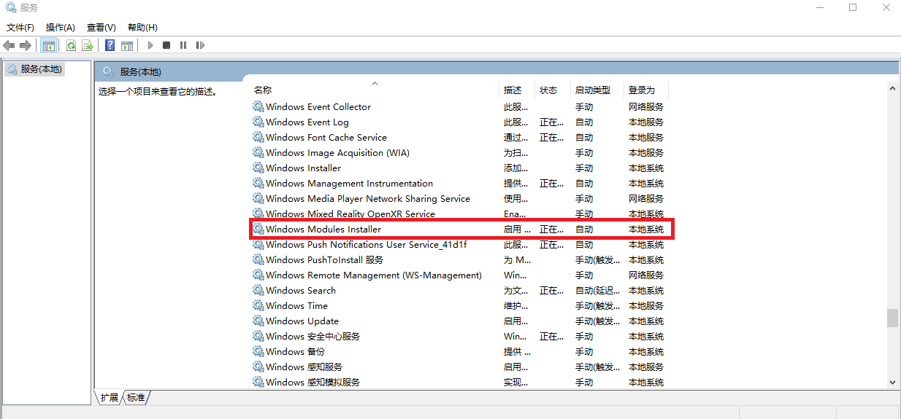
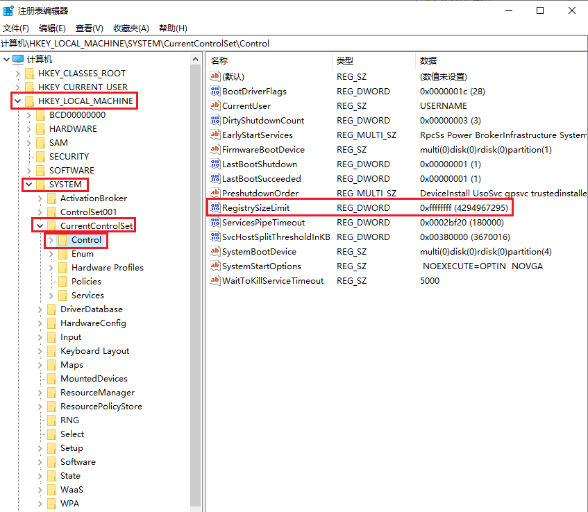

# Windows10：sfc /scannow显示"Windows 资源保护无法启动修复服务"

/*

* File: Windows10_sfc scannow显示Windows 资源保护无法启动修复服务.md
* Project: sfc scannow dead
* File Created: Monday, 15th November 2021 10:51:17 am
* Author: Hanlin Gu (hg_fine_codes@163.com)
* -----
* Last Modified: Saturday, 4th March 2023 5:00:02 pm
* Modified By: Hanlin Gu (hg_fine_codes@163.com>)
 */

> 参考：
>
> [windows资源保护无法启动修复服务](https://jingyan.baidu.com/article/eae078275e87891fec548502.html)

(1) 打开运行（`cmd`）并输入"`services.msc`"呼出"服务"


(2) 找到`Windows Modules Installer`服务项，启动它，并取消禁用




(3) 一般到第2步就可以正常运行了，如果仍然不能运行，则需要修改注册表。

继续打开运行（`cmd`）输入"`regedit`"

→ 打开
`"HKEY_LOCAL_MACHINE\SYSTEM\CurrentControlSet\Control"`文件（**注意**别弄错文件夹）

→ 新建`"DWORD(32位-值)"`并命名为`"RegistrySizeLimit"`

→ 编辑`"RegistrySizeLimit"`的值，改为`8个"f"`，并保存。




(4) 以`管理员身份`打开命令符（`cmd`），并输入"`sfc \scannow`"，就可以运行了。如果无法解决问题，那么可以在系统里安装升级，这样就解决问题了。

```script
sfc \scannow
```
