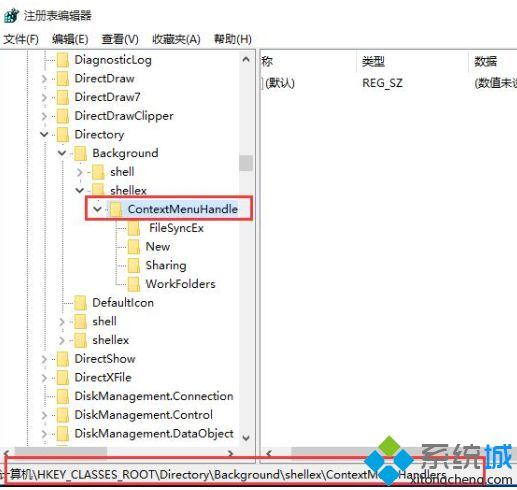

# Windows右键死机解决方法

<!-- TOC -->

- [1. 方法一：自动系统扫描](#1-方法一自动系统扫描)
- [2. 方法二](#2-方法二)

<!-- /TOC -->

<div style="page-break-after:always"></div>

> 参考：
>
> [win10右键文档卡死未响应的五种解决方法](http://www.xitongcheng.com/jiaocheng/win10_article_57339.html)

## 1. 方法一：自动系统扫描

(1) 右键点击任务栏上的Windows图标，选择命令提示符（cmd）→ 以管理员身份运行

(2) 逐一输入以下指令：

```shell
Dism /Online /Cleanup-Image /CheckHealth
```

```shell
Dism /Online /Cleanup-Image /ScanHealth
```

```shell
Dism /Online /Cleanup-Image /RestoreHealth
```

(3) 在`开始`中`右键`点击`"命令提示符（cmd）"` → 选择`"以管理员身份运行"`

```shell
sfc /scannow
```

(4) 重启电脑

(5) 如果出现”有一些文件无法修复“的回报，重复步骤1-3几次

## 2. 方法二

(1) 按`win+r`打开运行窗口，输入`refedit`，回车即可

(2) 依次展开：

`HEKY_CLASSES_ROOT\directory\background\shellex\contextmenuhandlers`，

然后打开`contextmenuhandlers`项，保留`“new”`、`“WorkFolders”`两项，其他的都删除

(3) 完成上面的设置，退出重新启动下系统即可

<!--  -->


